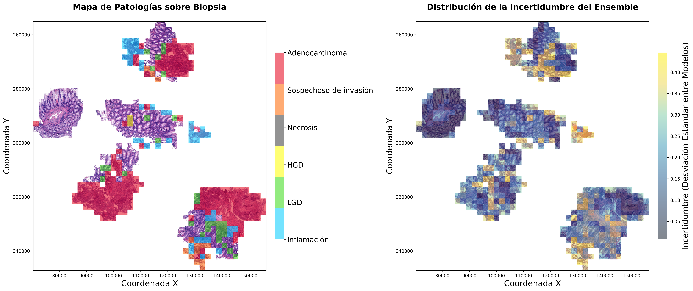

# TFG - Herramienta de clasificación celular mediante Aprendizaje Profundo

## Descripción

Este proyecto corresponde al **Trabajo de Fin de Grado de Guillermo González Tejedo** y tiene como objetivo desarrollar una herramienta computacional de clasificación celular basada en modelos de **Aprendizaje Profundo**, que sirva de apoyo a un patólogo durante el proceso clínico de diagnóstico de biopsias de **cáncer colorrectal**.

La herramienta permite procesar imágenes histológicas y obtener una clasificación de las células presentes en la biopsia y la incertidumbre presentada por el ensemble, facilitando la interpretación de los resultados mediante una representación visual.

---

# Instalación

## Clonar el repositorio

```bash
git clone https://github.com/GuigonteDEV/TFG_GuillermoGonzalez.git
cd TFG_GuillermoGonzalez
```

## Instalar dependencias

Se recomienda crear un entorno virtual antes de instalar las dependencias.

```bash
pip install -r requirements.txt
```

---

# Consideraciones importantes

La mayoría de scripts del proyecto utilizan rutas absolutas para acceder a los datos. Por ello, será necesario modificar las direcciones de las carpetas según la ubicación donde se encuentre el repositorio y el conjunto de datos.

Además, gran parte del código ha sido desarrollado para ejecutarse en el **cluster de supercomputación Artemisa**, por lo que muchos scripts utilizan `argparse` para recibir parámetros desde la línea de comandos. Si se desea ejecutar el proyecto en un ordenador local, probablemente sea necesario sustituir estos argumentos por variables definidas directamente en el código.

---

# Estructura del repositorio

A continuación se muestra la organización general del proyecto y la finalidad de cada parte.

```
TFG_GuillermoGonzalez
│
├── biopsies/
│   ├── 148_multiclass_UNI.h5
│   └── ...
│
├── checkpoints/
│   ├── best_UNI_binary_seed_22_fold_1.pth
│   └── ...
│
├── data/
│   ├── build_wsi.py
│   ├── extract_features_unl.py
│   ├── h5_hierarchical.py
│   └── h5_multilabel.py
│
├── notebooks/
│   ├── KFCV_Statistics.ipynb
│   └── results.ipynb
│
├── pipelines/
│   ├── inference_hierarchical.py
│   ├── inference_multilabel.py
│   ├── inference_UNI.py
│   ├── train_binary.py
│   ├── train_multiclass.py
│   ├── train_multilabel.py
│   ├── train_UNI_binary.py
│   └── train_UNI_multiclass.py
│
├── results/
│   ├── metrics_report_hierarchical.py
│   └── metrics_report_multilabel.py
│
├── src/
│   ├── __init__.py
│   ├── balancing_methods.py
│   ├── models.py
│   ├── threshold_tuning_binary.py
│   ├── threshold_tuning.py
│   └── utils.py
│
├── main.py
│
├── map_biopsy_148_UNI.png
│
├── requirements.txt
│
└── README.md
```

### Descripción de las carpetas

- **biopsies/**  
  Contiene varias biopsias de ejemplo que permiten probar el funcionamiento de la herramienta sin necesidad de utilizar un conjunto de datos externo.

- **checkpoints/**  
  Almacena los pesos de los modelos entrenados utilizados durante la inferencia.

- **data/**  
  Incluye scripts para la creación de los datos de entrada de los diferentes modelos.

- **notebooks/**  
  Contiene los cuadernos de Jupyter utilizados durante el desarrollo del TFG para realizar pruebas y análisis de resultados.

- **pipelines/**  
  Incluye los scripts que automatizan las distintas etapas del entrenamiento e inferencia de los modelos.

- **results/**  
  Contiene los scripts utilizados para producir informes de las métricas de rendimiento de cada sistema evaluado.

- **src/**  
  Contiene el código fuente del proyecto, donde se implementan los distintos módulos utilizados durante el procesamiento, entrenamiento e inferencia.

### Archivos principales

- **main.py**  
  Es el punto de entrada de la aplicación. Desde este script se ejecuta el flujo completo de la herramienta, realizando el procesamiento de la biopsia y generando la clasificación celular final.

- **requirements.txt**  
  Contiene todas las dependencias necesarias para ejecutar el proyecto.

---

# Ejemplo de funcionamiento

En el repositorio se han incluido varias **biopsias de ejemplo** para poder probar el funcionamiento de la herramienta sin necesidad de preparar un conjunto de datos adicional.

Tras ejecutar el proceso completo, el sistema genera una imagen donde se representa la clasificación realizada sobre la biopsia.

## Resultado obtenido

> Sustituir la ruta por la ubicación real de la imagen dentro del repositorio.

```markdown

```

---

# Autor

Guillermo González Tejedo

Trabajo de Fin de Grado

Grado en Física